# 🤖 ClaudeAssist - 完整系统功能架构脑图

**最后更新**: 2026年5月16日  
**系统版本**: 2026.05.6  
**功能模块**: 7 大核心系统、50+ 功能模块、100+ 子功能

---

## 📊 系统架构概览

ClaudeAssist 是一个全面的 Claude Code 和 AI 编码工具生态参考系统，整合了：

| 模块 | 描述 | 功能数 |
|------|------|--------|
| 📚 **基础参考** | Slash Commands、CLI标志、快捷键、设置、模式、技能 | 12+ |
| 🌐 **AI 生态** | 36个模型、22个工具、3个组合方案 | 61 |
| 📊 **功能工作台** | 工具台、模型台、决策推荐 | 3 |
| 📋 **报告系统** | 生成、管理、导出、分享、追踪 | 5 |
| 🔍 **搜索导航** | 全局搜索、菜单导航、页面架构 | 3 |
| 🌍 **国际化** | 13语言支持、区域化适配 | 13 |
| 🎨 **UI & 安全** | 主题、响应式、可访问性、数据安全 | 8+ |

---

## 🌳 完整功能脑图

```mermaid
mindmap
  root((🤖 ClaudeAssist<br/>Claude Code<br/>完整参考系统))
    📚 基础参考模块
      💻 Slash Commands
        代码生成与分析
          @generate-code
          @optimize
          @review
          @test
        工程能力
          @refactor
          @document
          @explain
          @translate
      🚀 CLI 标志 (Flags)
        认证与安全
          --auth
          --token
          --api-key
        执行配置
          --mode
          --reasoning
          --timeout
        输出控制
          --format
          --verbose
          --silent
      ⌨️ 快捷键
        编辑器快捷键
          Cmd+K / Ctrl+K
          Cmd+I / Ctrl+I
          Cmd+Shift+L
        导航快捷键
          文件切换
          代码跳转
          历史导航
      ⚙️ 应用设置
        模型配置
          默认模型选择
          温度与参数
          Token 限制
        编辑器集成
          主题设置
          快捷键自定义
          扩展管理
      🎯 应用模式
        代码补完模式
          自动补完
          多语言支持
          实时反馈
        Agent 自主模式
          多步骤推理
          文件系统操作
          代码执行验证
        交互式模式
          Chat 对话
          代码块标注
          即时预览
      🔑 技能系统
        编码技能
          Python 开发
          JavaScript/TS 开发
          Go/Rust 开发
        工程技能
          单元测试编写
          性能优化
          代码安全审计
        运维技能
          CI/CD 流程
          容器化部署
          基础设施即代码
    🌐 AI 生态系统
      🧠 AI 大模型库
        Frontier 模型
          OpenAI
            GPT-5.5 (最强推理)
            GPT-5.4 (平衡方案)
            o3-mini (推理优化)
          Anthropic
            Claude Opus 4.7 (顶级推理)
            Claude Sonnet 4.6 (均衡)
            Claude Haiku 4.5 (轻量)
          Google DeepMind
            Gemini 2.5 Pro (全能)
            Gemini 2.5 Flash (快速)
          DeepSeek
            V3 (中文优化)
            R1 (推理模型)
          Alibaba
            Qwen 2.5 Plus
            Qwen 2.5 Turbo
        开源模型
          Llama 3.3
          Mistral 7B
          Phi 4
        特化模型
          编码专用 (CodeLlama)
          多模态 (Vision)
          长上下文 (200K+ tokens)
      💻 AI 编码工具
        IDE 级集成
          GitHub Copilot Individual
            全 IDE 覆盖
            多模型支持
            Agent 模式
          Cursor IDE
            完整 IDE
            易用界面
            离线能力
          JetBrains AI Assistant
            IDE 原生
            深度集成
            社区最多
        编辑器扩展
          Claude Code (CLI+Web)
            终端操作
            多步 Agent
            即时执行
          VS Code Copilot Extension
            补完优先
            快速响应
            轻量级
          Cline (Open Source)
            灵活自定义
            本地部署
            隐私友好
        命令行工具
          Aider CLI
            版本控制
            Git 集成
            多文件协作
          Continue Dev
            代理配置
            自定义模型
            离线运行
        云端平台
          Replit
            实时预览
            协作编辑
            一键部署
          GitHub Codespaces
            云开发环境
            资源充足
            GitHub 集成
      🔗 工具+模型组合方案
        中国开发者成本优化
          工具：Claude Code CLI
          模型：DeepSeek V3
          特点：成本最低
        企业级可靠性方案
          工具：Cursor IDE
          模型：Claude Opus 4.7
          特点：企业首选
        开源爱好者方案
          工具：Cline + Continue
          模型：Llama 3.3 (本地)
          特点：完全自由
    📊 功能工作台
      🛠️ 工具工作台
        工具多维度对比
          成本与性价比
          功能完整性
          国内可访问性
          集成深度
        工具推荐引擎
          场景匹配
          最佳实践
          风险评估
        工具组合与配置
          兼容性检查
          工作流优化
          性能微调
      📈 模型生态工作台
        模型多维度分析
          推理能力评分
          代码生成评分
          性价比对比
          国内可用性
        模型选择向导
          场景需求输入
          推荐排序
          成本预估
        批量对比表格
          排序与筛选
          自定义字段
          导出数据
      🎯 决策推荐系统
        场景识别
          中国开发者低成本编码
          企业级可靠性需求
          学习新技术栈
          大规模重构项目
        推荐生成
          首选方案 (原因+风险)
          替代方案 (对比分析)
          规避方案 (负面证据)
        证据链支持
          数据来源链接
          最后验证时间
          数据版本标记
    📋 报告系统
      📄 报告生成引擎
        场景推荐报告
          工具推荐
          模型评估
          成本分析
          实施指南
        工具对比报告
          多维度对标
          功能矩阵
          成本对比
          优缺点分析
        模型价格报告
          全球定价对比
          国内可用性分析
          免费层次统计
          按量计费预估
      📥 报告管理
        生成与保存
          SessionStorage 持久化
          自动编号与时间戳
          报告元数据保存
        查看与分享
          报告详情页
          链接分享
          权限管理 (可选)
        导出功能
          Markdown 导出
          JSON 导出
          PDF 导出 (可选)
        历史追踪
          生成历史列表
          删除与恢复
          版本对比 (可选)
    🔍 搜索与导航
      🔎 全局搜索
        命令搜索
          Slash commands
          按功能分类
          快捷键搜索
        工具搜索
          工具库全文搜索
          标签过滤
          推荐排序
        模型搜索
          模型库全文搜索
          价格范围过滤
          能力过滤
      📍 菜单导航
        工具导航
          AI Coding Tools 分类
          工具详情 Profile
          Claude Code 核心工具
          其他工具导航
        模型导航
          AI Models 生态
          模型详情 Profile
          推荐模型指南
        功能导航
          工作台中心
          报告库
          参考手册
      📱 页面架构
        首页
          功能概览
          快速导航
          最新推荐
          社区动态
        详情页
          工具/模型详细信息
          完整能力展示
          价格与成本分析
          用户评价与反馈
        对比工作台
          多选对比
          排序与筛选
          导出与分享
        报告生成页
          参数配置
          预览生成
          分享与保存
    🌍 多语言与国际化
      🇨🇳 中文支持
        简体中文 (简中)
        繁体中文 (繁体)
        中国区优化
          国内访问优化
          成本本地化
          法规合规性
      🌐 多语言支持
        英语 (English)
        日语 (日本語)
        韩语 (한국어)
        法语 (Français)
        德语 (Deutsch)
        西班牙语 (Español)
        葡萄牙语 (Português)
        俄语 (Русский)
        意大利语 (Italiano)
        荷兰语 (Nederlands)
        土耳其语 (Türkçe)
      🎨 区域化适配
        货币本地化 (USD/CNY)
        日期时间格式
        单位转换 (Tokens)
        文化用语调整
    🎨 用户界面
      🎯 主题与样式
        浅色主题
          清爽配色
          高对比度
          可访问性
        暗色主题
          护眼配色
          低蓝光
          OLED 优化
      📱 响应式设计
        移动设备
          单列布局
          触摸友好
          加载优化
        平板设备
          两列布局
          自适应
          横屏支持
        桌面设备
          多列布局
          侧边栏
          快捷操作
      ♿ 可访问性
        键盘导航
          Tab 键导航
          Enter 确认
          Escape 关闭
        屏幕阅读器
          ARIA 标签
          语义化 HTML
          焦点管理
        高对比度
          颜色对比
          文字大小
          粗体支持
    ⚡ 高级功能
      🔄 数据同步
        实时更新
          模型价格更新
          工具状态变更
          推荐算法迭代
        版本管理
          数据版本控制
          变更历史
          回滚机制
      🛡️ 隐私与安全
        本地存储
          SessionStorage 报告
          LocalStorage 偏好
          无云端同步
        HTTPS 加密
          数据传输安全
          链接分享安全
          第三方脚本审计
      📊 分析与监测
        用户行为分析
          功能使用频率
          搜索热词
          转化漏斗
        性能监测
          页面加载时间
          搜索响应速度
          报告生成时间
      🤝 社区功能
        用户反馈
          功能建议
          Bug 报告
          内容贡献
        社区资源
          教程文档
          最佳实践
          用例分享
```

---

## 📋 核心功能详解

### 1️⃣ 基础参考模块 (12+ 功能)

**Claude Code 完整命令参考**：
- **Slash Commands** (6个命令)：@generate-code、@optimize、@review、@test、@refactor、@document 等
- **CLI 标志** (15+)：认证、执行配置、输出控制等
- **快捷键** (3大类)：编辑器快捷键、导航快捷键、工作流快捷键
- **应用设置**：模型配置、编辑器集成、个性化设置
- **应用模式** (3种)：代码补完、Agent 自主、交互式对话
- **技能系统** (3大类)：编码、工程、运维技能

### 2️⃣ AI 生态系统 (61+ 项)

**AI 大模型库 (36个)**：
- **Frontier 模型** (12个)：OpenAI (GPT-5.5/5.4)、Anthropic (Claude系列)、Google (Gemini)、DeepSeek (V3/R1)、Alibaba (Qwen)
- **开源模型** (3个)：Llama、Mistral、Phi
- **特化模型** (3个)：编码、多模态、长上下文

**AI 编码工具 (22个)**：
- **IDE 级集成** (3个)：GitHub Copilot、Cursor IDE、JetBrains
- **编辑器扩展** (3个)：Claude Code、VS Code Copilot、Cline
- **命令行工具** (2个)：Aider、Continue
- **云端平台** (2个)：Replit、GitHub Codespaces
- **其他工具** (10个)：Tabnine、CodeWhisperer、Windsurf 等

**工具+模型组合方案 (3个)**：
- 中国开发者成本优化：Claude Code + DeepSeek V3
- 企业级可靠性：Cursor IDE + Claude Opus 4.7
- 开源爱好者：Cline + Llama 3.3

### 3️⃣ 功能工作台 (3个子系统)

| 工作台 | 功能 | 用途 |
|--------|------|------|
| 🛠️ **工具工作台** | 多维度对比、推荐引擎、组合配置 | 选择最佳AI编码工具 |
| 📈 **模型生态台** | 多维度分析、选择向导、对比表格 | 选择最适合的AI模型 |
| 🎯 **决策推荐** | 场景识别、推荐生成、证据链支持 | 基于需求的方案推荐 |

### 4️⃣ 报告系统 (完整生命周期)

**报告类型**：
1. **场景推荐报告**：工具+模型+成本+实施指南
2. **工具对比报告**：多工具对标、功能矩阵、成本对比
3. **模型价格报告**：全球定价、国内可用性、成本预估

**管理功能**：
- ✅ 生成与保存 (SessionStorage)
- ✅ 查看与分享 (链接分享)
- ✅ 导出 (Markdown、JSON)
- ✅ 历史追踪 (删除、恢复)

### 5️⃣ 搜索与导航

- **全局搜索**：命令、工具、模型
- **菜单导航**：工具导航、模型导航、功能导航
- **页面架构**：首页、详情页、工作台、报告页

### 6️⃣ 国际化 (13 语言)

🇨🇳 中文 (简体、繁体)  
🌐 English、日本語、한국어、Français、Deutsch、Español、Português、Русский、Italiano、Nederlands、Türkçe

### 7️⃣ UI & 高级功能

**UI**：浅色/暗色主题、响应式设计、无障碍访问  
**安全**：本地存储、HTTPS 加密、隐私保护  
**监测**：用户行为分析、性能监测  
**社区**：用户反馈、社区资源

---

## 🎯 关键数据指标

| 指标 | 数值 |
|------|------|
| **AI 模型** | 36 个 |
| **AI 工具** | 22 个 |
| **工具+模型组合** | 3 个 |
| **支持语言** | 13 种 |
| **报告类型** | 3 种 |
| **工作台** | 3 个 |
| **功能模块** | 50+ |
| **子功能** | 100+ |

---

## 🚀 技术实现

**前端框架**：
- React 19 + TypeScript 5.7
- Vite 6.x (构建工具)
- Tailwind CSS v4 (样式)
- React Router v7 (路由)

**数据架构**：
- Query API 函数 (getTools, getModels)
- SessionStorage 报告持久化
- i18n 多语言支持
- 厂商 logo 自动注入

**UI 组件**：
- ToolCard、ModelCard (卡片展示)
- ToolCombinations、ReportRenderer (内容展示)
- Sidebar、TopBar (导航)
- 响应式布局 (mobile/tablet/desktop)

---

## 📝 导出与使用

本脑图可用于：
- 📊 系统功能总体规划
- 📖 功能文档编写
- 🎓 新人培训
- 🔍 功能审计与验证
- 💡 需求分析与设计

**导出建议**：
- 👉 用 MermaidJS 在线编辑器查看交互版本
- 👉 导出为 PNG/SVG 用于演示
- 👉 复制 Markdown 到项目 Wiki
- 👉 集成到项目文档系统

---

**维护负责人**: AI Assistant  
**最后更新**: 2026-05-16  
**版本**: 1.0
